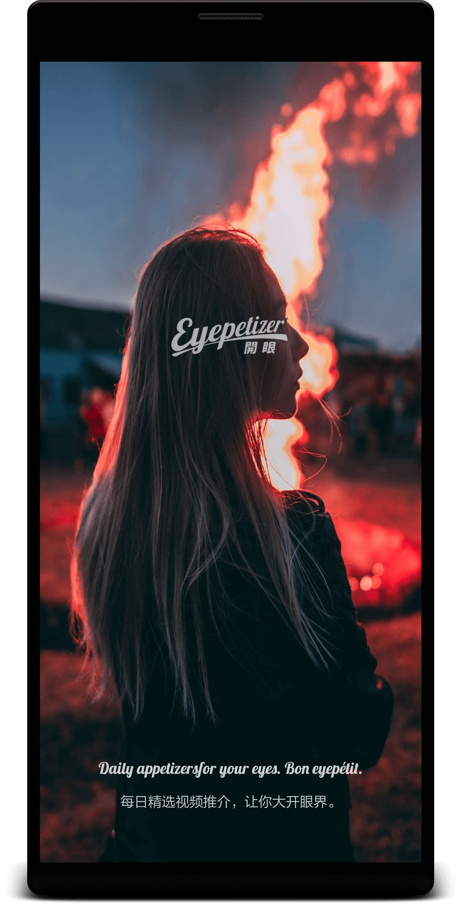
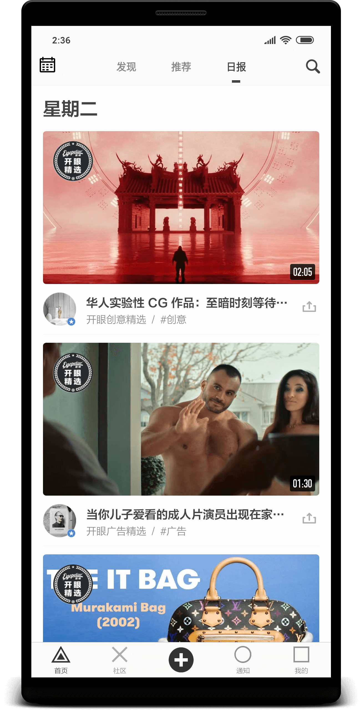
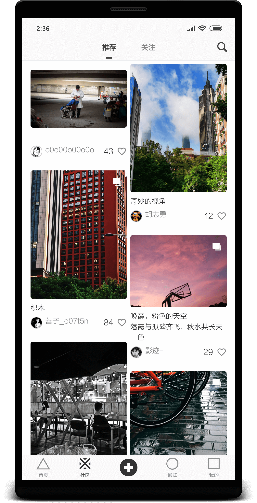
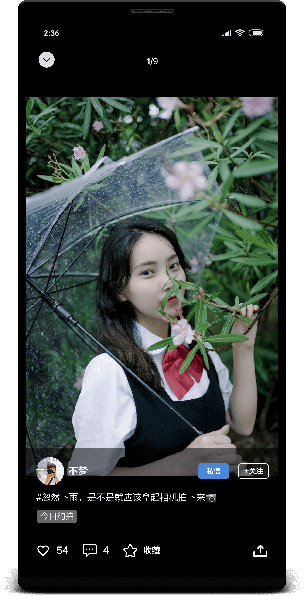
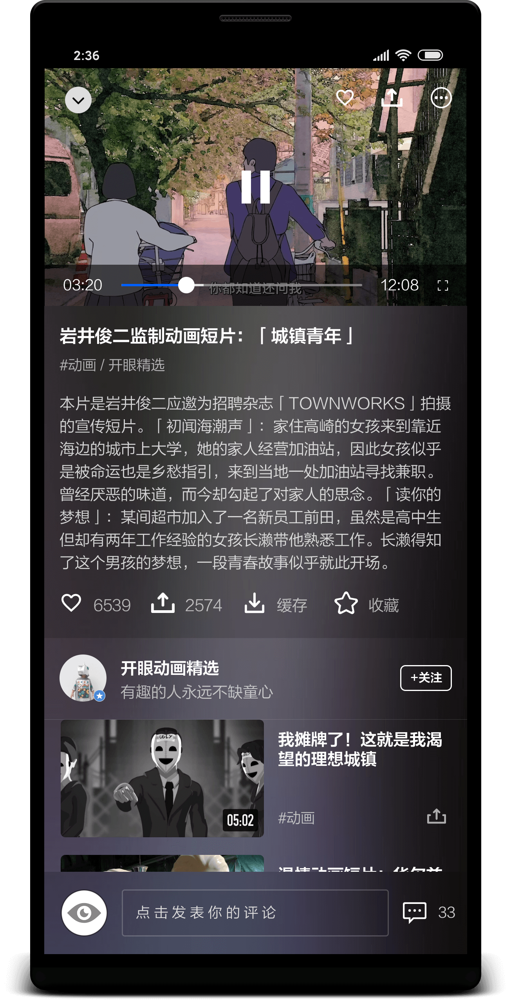
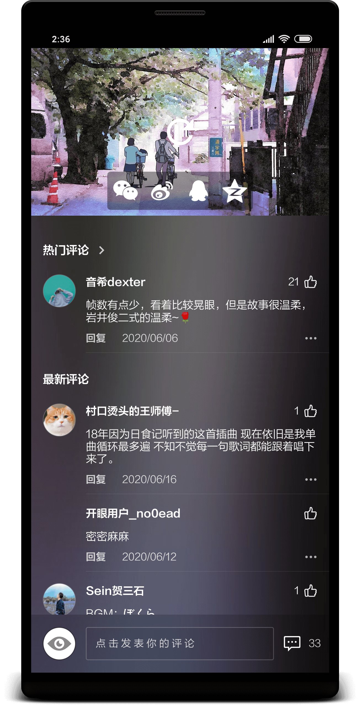
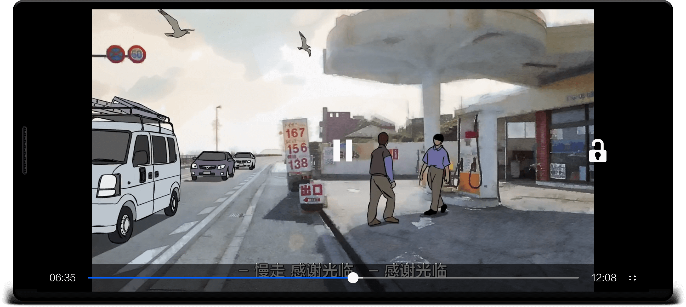
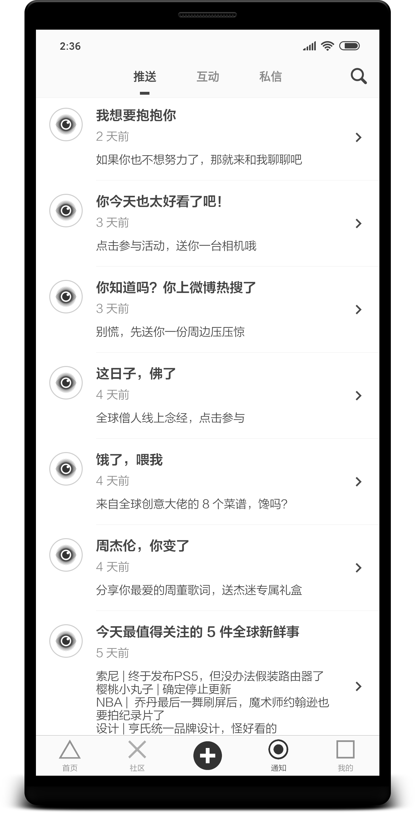

English | [中文](README.md)

# Eyepetizer
[][33]
[][34]
[][35]
[][36]

A short video Android client project based on [Kotlin][1] language imitation "[Open Eyepetizer][2]", using the MVVM architecture implemented by [Jetpack][3] + [Coroutine][30].

## Brief introduction
This is a short video Android client project with a high imitation of "[Open Eyepetizer][2]". Personally, I feel that the UI design style of this app is very beautiful, and the interface is simple and fresh. Through this project, I will learn and integrate related technologies.

There is no complicated encapsulation of the entire project, and the project development specifications refer to [Kotlin official documents][4] and third-party [AndroidStandardDevelop][5]. Personally think that the code is relatively easy to read and understand, so it is also very suitable for novices to get started with the Kotlin language, and at the same time master the use of Jetpack components faster.

It is also worth mentioning that all UIs are measured by the annotation tool, and the font color, size, spacing, etc. are almost **pixel-level** imitated "Open EyeEyeizer" Android client App, corresponding to v6 .3.1 version . ([View historical version][31])

## Screenshots





<br></br>

<br></br>

<br></br>

Can't load images? Attach [blog address][6]
<br></br>

## Download experience
- Scan the QR code to install:<br></br>
   <a href="https://www.pgyer.com/eyepetizer"></a>

- [Click to download eyepetizer.apk][7]

## The main function
- Watch high-quality HD short videos and comments.
- Browse community graphics and video creation.
- Check daily fresh news and hot search keywords.
- Share exciting short videos and fresh information.

## Use tools
- [Vector Asset Studio][8] Icon making
- [iconfont][9] Icon/Design
- [Postman][10] API Debugger
- [Charles][11] API Packet capture
- [PxCook][12] Annotation tool
- [Development assistant][13] Decompile application, extract application Apk, etc.

## Change Log
[View Release History Update Log][32]

## About me
- RealName : YinZhiWei
- NickName : vipyinzhiwei
- WeChat : vipyinzhiwei
- Email : <vipyinzhiwei@gmail.com>
- Blog : <https://www.vipyinzhiwei.com>

## Encourage
Through this project, I hope to help you better learn Jetpack and MVVM architecture. If you like the design of Eyepetizer, and feel that the source code of this project is helpful for your study, you can click **"Star"** in the upper right corner to support it, thank you! ^_^

## Express one's thanks
- [Retrofit][14] Network request framework encapsulation
- [Glide][15] Image loading
- [OkHttp][16] Network request
- [Gson][17] Gson analysis
- [Glide Transformations][18] Image conversion
- [Eventbus][19] Event bus
- [Permissionx][20] Dynamic request permission encapsulation
- [FlycoTabLayout][21] TabLayout encapsulation
- [SmartRefreshLayout][22] Pull down refresh frame
- [BannerViewPager][23] Banner carousel
- [Immersionbar][24] Status bar management
- [PhotoView][25] Support gesture zoom picture
- [Circleimageview][26] Round image
- [GSYVideoPlayer][27] Video player
- [VasSonic][28] Improve H5 first screen loading speed
- [Leakcanary][29] Memory leak detection
- [Kotlinx Coroutines][30] Simplify code management background threads and callbacks


## License

**All data comes from open eyes, only for learning and communication use, strictly prohibited for any commercial use, the original company has all rights.**

```
Copyright (c) 2020. vipyinzhiwei <vipyinzhiwei@gmail.com>

Licensed under the Apache License, Version 2.0 (the "License");
you may not use this file except in compliance with the License.
You may obtain a copy of the License at

    http://www.apache.org/licenses/LICENSE-2.0

Unless required by applicable law or agreed to in writing, software
distributed under the License is distributed on an "AS IS" BASIS,
WITHOUT WARRANTIES OR CONDITIONS OF ANY KIND, either express or implied.
See the License for the specific language governing permissions and
limitations under the License.
```

[1]:https://kotlinlang.org
[2]:https://www.kaiyanapp.com
[3]:https://developer.android.com/jetpack
[4]:https://www.kotlincn.net/docs/reference/coding-conventions.html
[5]:https://github.com/Blankj/AndroidStandardDevelop
[6]:https://www.vipyinzhiwei.com/2020/06/19/pager05/#more
[7]:https://github.com/VIPyinzhiwei/Eyepetizer/raw/master/eyepetizer.apk
[8]:https://developer.android.com/studio/write/vector-asset-studio?hl=zh-cn
[9]:https://www.iconfont.cn
[10]:https://www.postman.com
[11]:https://www.charlesproxy.com
[12]:https://www.fancynode.com.cn/pxcook
[13]:https://github.com/Trinea/android-open-project/issues/314
[14]:https://github.com/square/retrofit
[15]:https://github.com/bumptech/glide
[16]:https://github.com/square/okhttp
[17]:https://github.com/google/gson
[18]:https://github.com/wasabeef/glide-transformations
[19]:https://github.com/greenrobot/EventBus
[20]:https://github.com/guolindev/PermissionX
[21]:https://github.com/H07000223/FlycoTabLayout
[22]:https://github.com/scwang90/SmartRefreshLayout
[23]:https://github.com/zhpanvip/BannerViewPager
[24]:https://github.com/gyf-dev/ImmersionBar
[25]:https://github.com/chrisbanes/PhotoView
[26]:https://github.com/hdodenhof/CircleImageView
[27]:https://github.com/CarGuo/GSYVideoPlayer
[28]:https://github.com/Tencent/VasSonic
[29]:https://github.com/square/leakcanary
[30]:https://github.com/Kotlin/kotlinx.coroutines
[31]:https://m.apkpure.com/cn/%E5%BC%80%E7%9C%BC/com.wandoujia.eyepetizer/versions
[32]:https://github.com/VIPyinzhiwei/Eyepetizer/releases
[33]:https://devlibrary.withgoogle.com/products/android/repos/VIPyinzhiwei-Eyepetizer
[34]:https://opensource.org/licenses/Apache-2.0
[35]:https://android-arsenal.com/api?level=21
[36]:https://github.com/VIPyinzhiwei